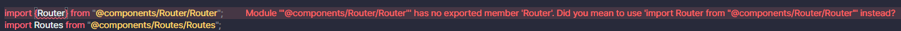
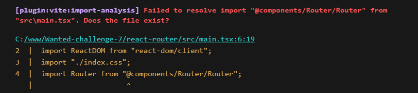

# SPA 라우터 구현하기

## 과제 요구사항

**1) 해당 주소로 진입했을 때 아래 주소에 맞는 페이지가 렌더링 되어야 한다.**

- `/` → `root` 페이지
- `/about` → `about` 페이지

**2) 버튼을 클릭하면 해당 페이지로, 뒤로 가기 버튼을 눌렀을 때 이전 페이지로 이동해야 한다.**

- 힌트) `window.onpopstate`, `window.location.pathname` ,History API(`pushState`)

**3) Router, Route 컴포넌트를 구현해야 하며, 형태는 아래와 같아야 한다.**

```tsx
ReactDOM.createRoot(container).render(
  <Router>
    <Route path="/" component={<Root />} />
    <Route path="/about" component={<About />} />
  </Router>
);
```

**4) 최소한의 push 기능을 가진 useRouter Hook을 작성한다.**

```tsx
const { push } = useRouter();
```

## 힌트 사용하기

힌트를 쓰려면 일단 저 이벤트들이 뭔지부터 찾아봐야했다. 알아야 하는 건 총 세 가지, `window.onpopstate`, `window.location.pathname`, History API(`pushState`) 인데 그나마 저 중 2가지는 어렴풋하게 개념을 알고 있었다. 하지만 그것보다 훨씬 구체적으로 정립해보았다.

### window.onpopstate와 window.location.pathname

#### 1. window.onpopstate

> MDN Web docs: **window.onpopstate**
>
> Window 인터페이스의 popstate 이벤트는 사용자의 세션 기록 탐색으로 인해 현재 활성화된 기록 항목이 바뀔 때 발생합니다. 만약 활성화된 엔트리가 `history.pushState()` 메서드나 `history.replaceState()` 메서드에 의해 생성되면, popstate 이벤트의 state 속성은 히스토리 엔트리 state 객체의 복사본을 갖게 됩니다.

MDN에서 언급한 것처럼 `pushState` 이벤트나 `replaceState` 이벤트에 의해 생성된 히스토리 엔트리가 활성화되면 `popState` 내 프로퍼티인 `state`가 이 히스토리 엔트리의 복사본을 갖고 있게 된다.

이런 특성 때문에 `pushState`와 함께 여러 가지 기능을 만드는데 쓰는 예시들을 많이 찾을 수 있었다.

#### 2. window.location.pathname

> MDN Web docs: **window.location.pathname**
>
> `pathname` 속성은 URL의 경로와 그 앞의 /로 이루어진 USVString을 반환합니다. 경로가 없는 경우 빈 문자열을 반환합니다.

`window.location.pathname`, `document.location.pathname`, `location.pathname`, `url.pathname` 등 여러 인터페이스에서 호출이 가능한 이 `pathname` 속성은 URL에서 '/' 이후 문자열을 반환하므로 페이지 이동을 구현할 때 자주 보게 된다.

URL을 통해 서버로 GET 요청을 보내게 되므로 `pathname`에는 어떤 정보를 요청하는지 자세한 내용을 담게 된다. 만약 쇼핑몰 같은 웹사이트에서 회원별로 숫자 ID를 무작위로 부여해 그 숫자로 마이페이지로 이동하는 기능이 있다고 가정해보자. 그럼 URL은 "www.shopping.com/mypage/394812" 와 같은 형식이 되고, `pathname`인 "/mypage/394812"에는 이동할 페이지와 회원의 ID 같은 정보를 담고 있게 된다.

### History API(`pushState`)

> MDN Web docs: **History.pushState()**
>
> HTML 문서에서, `history.pushState()` 메서드는 브라우저의 세션 기록 스택에 상태를 추가합니다.
>
> ```javascript
> history.pushState(state, title[, url]);
> ```

SPA 단점 중 하나가 주소가 바뀌지 않는다는 것인데, 이를 해결하기 위해 초창기에는 /#(해쉬), /#!(해쉬뱅)을 붙이고, pathname을 붙였다고 한다. 하지만 아무 의미도 없는 해쉬를 중간에 넣어 pathname을 지정하는 건 보기에도 이상했고, 서버에서도 제대로 된 주소로 인식하지 않았다.

이에 따라 브라우저에서 제공하는 History API를 통해 주소를 변경하는 방식으로 바꾸게 되었고, 요즘의 SPA 라우터들은 이 API를 사용하고 있다고 한다.

History API의 경우 기존 `window.history` 객체를 그대로 활용하기 때문에 JavaScript를 활용해 *뒤로 가기, 앞으로 가기, 지정한 위치*로 가기 기능을 모두 구현할 수 있다.

히스토리 스택은 하나의 목록이고, *뒤로 가기와, 앞으로 가기*는 목록 내에서 이동하는 셈이다. 그래서 목록에 새 히스토리를 추가하면 페이지를 이동한 게 되는데, 이를 추가하기 위한 메소드가 바로 `pushState`다. 이를 활용하면 **페이지는 갱신되지 않았는데 주소만 바뀐 효과**를 누릴 수 있다! 이게 바로 SPA에서 필요한 기능이라는 걸 깨달았다. 하나의 페이지에서 머무르는 것처럼 사용자가 느끼지 않게 요청하는 컴포넌트를 라우팅 기능으로 보여주자.

## Vite로 보일러 플레이트 구성하기

Vite를 사용해 React-ts 환경을 구성


## 트러블슈팅 🔫

### 1. Module Import


모듈을 가져올 때 중괄호를 쓰는 것과 안 쓰는 것의 차이를 몰라서 하나는 중괄호를 쓰고, 하나는 안 써봤다. 그랬더니 중괄호를 쓴 경우에 에러가 바로 발생했다. 다른 거라고는 중괄호 뿐이었는데 뭐가 문제였을까 싶어 구글에 검색해봤다.

- 원인: export 할 때 사용한 default 키워드

export를 하는 방법은 **default** 키워드를 사용하여 기본 export될 요소를 정하는 것과, 아니면 키워드를 쓰지 않는 _named export 방법_ 두 가지다. 그런데 그 중 default 키워드를 사용했을 경우에는 import 시에 중괄호를 쓰면 에러가 났다.

default 키워드는 그 모듈에서는 단 하나의 요소에만 적용해서 export 할 수 있다. 그렇기에 컴포넌트 내에서 named export와 병렬적으로 사용해서 여러 개의 요소를 export 할 수는 있지만, default 키워드가 달린 요소를 import 할 경우에는 중괄호를 쓰지 않는 것이 원칙이었다.

예를 들어서 하나의 모듈에서 default export와 named export를 동시에 import하고 싶을 때는 아래와 같이 처리할 수 있다.

```javascript
// default 키워드가 들어간 요소는 중괄호에서 배제한다.
// 구조분해할당(destructuring)을 이용하여 각각의 구성요소를 import하는 방식
import defaultExport, { namedExport1, namedExport2 } from "./module";

// 모듈 전체를 import 한다.
// 모듈 전체를 약속된 별칭으로 가져와서 사용하는 방식
import * as myModule from "./module";
```

### 2. tsconfig Path

모든 작업을 완료하고 더이상 코드 에디터 상 오류도 안 보이길래 자신만만하게 dev 서버를 열었는데, 브라우저에 나타난 에러 메시지가 심상치 않았다. Router 컴포넌트를 import 한 main 컴포넌트에서 파일을 찾지 못했다는 메시지였다. Router 컴포넌트에 export를 안했나 싶어 급하게 확인했는데 그랬으면 코드 에디터 상에서 먼저 에러 메시지가 보였어야 했다. 분명 컴포넌트 export, import 둘 다 잘 됐는데 왜 브라우저에서는 파일을 찾지 못하는 걸까?



- 원인: vite.config.js 파일에서 alias 설정 X

tsconfig.json 파일에는 baseUrl과 path가 설정되어있으나, vite에서 번들링할 때 타입스크립트의 path를 인식하지 못해서 발생하는 문제였다.

그래서 이를 해결하기 위해 찾은 두 가지 방법은 아래와 같다.

```javascript
// vite.config.js 파일에서 직접 alias 설정
//  vite-config-test 브랜치 참고
//  npm i --save-dev @types/node 명령어로 @types/node 디펜던시 추가
import path from "path";
...
plugins: [react()],
resolve: {
    alias: [
      { find: "@", replacement: path.resolve(__dirname, "src") },
      { find: "@pages", replacement: path.resolve(__dirname, "src/pages") },
    ],
  },


  // tsconfigPath 플러그인 추가
  // npm i vite-tsconfig-paths 명령어로 플러그인 추가
import tsconfigPaths from "vite-tsconfig-paths";
...
plugins: [react(), tsconfigPaths()],
```

두 방법 중에서도 내가 선택한 건 tsconfigPath 플러그인을 사용하는 방식이다. config 파일에서 플러그인만 추가해주면 일일이 alias를 추가할 필요가 없었기 때문에 확실히 프로젝트에서 모듈 경로(alias) 관리를 용이했다. 두 방법 중 어떤 걸 사용해도 문제는 바로 해결됐다.
